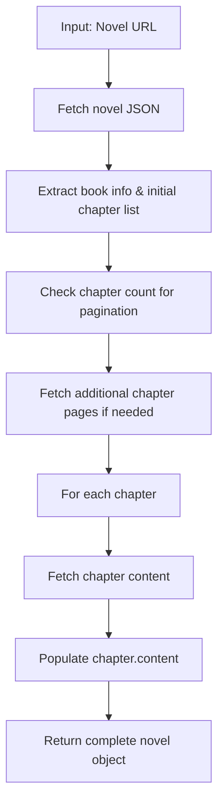

# Browser Novel Extractor Plan

## Overview
Create a single, short JavaScript method that runs directly in the browser console to extract novel information, chapter list, and chapter content from truyenchucv.org. The method takes a full novel URL as input and returns a complete novel object with all chapter contents populated.

## Requirements
- Input: Full novel URL (e.g., 'https://truyenchucv.org/truyen/toan-dan-linh-chu-vo-dich-theo-trieu-hoan-nu-de-bat-dau.html')
- Output: Novel object containing book info, chapter list with populated content
- Browser-compatible: Uses fetch API, async/await
- Short and simple: Minimal code, no external dependencies

## Implementation Steps
1. Design async function structure
2. Implement novel data fetching with pagination handling
3. Implement chapter content fetching for each chapter
4. Combine all data into return object
5. Test for correctness and simplicity

## Data Flow


## Function Signature
```javascript
async function extractNovel(novelUrl) {
    // Implementation
    return novelData;
}