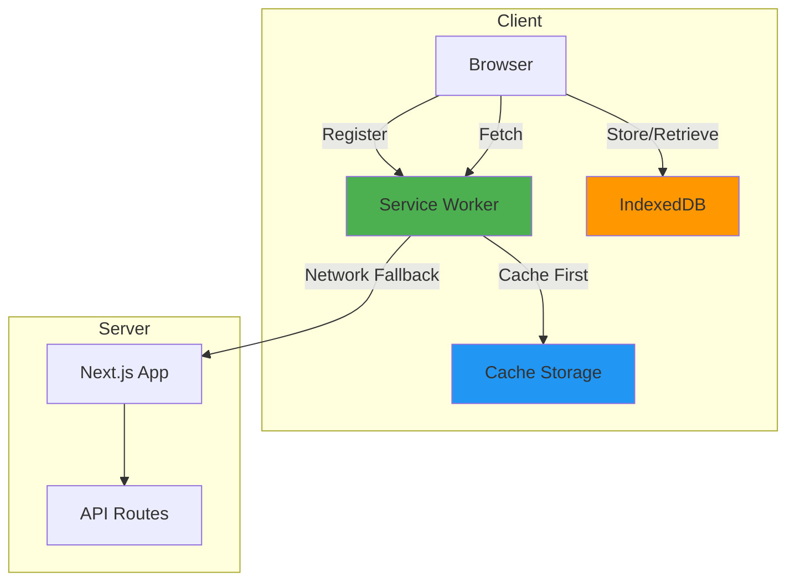
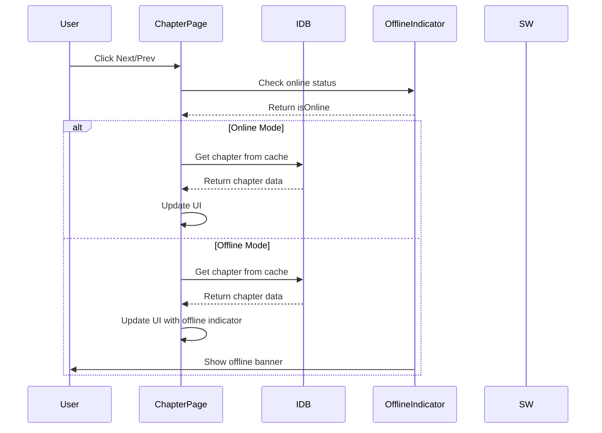

# PWA Implementation Plan for Novel Reader

## Overview
Add Progressive Web App (PWA) functionality to enable installation on iPhone and provide limited offline support for chapter navigation.

## PWA Architecture



## Offline Navigation Flow



## Implementation Steps

### 1. Install Dependencies
- Install `next-pwa` package for PWA support

### 2. Create App Icons
Generate app icons in multiple sizes:
- `icon-192x192.png` - Android/Mobile icon (192x192)
- `icon-512x512.png` - Android/Mobile icon (512x512)
- `apple-touch-icon.png` - iOS icon (180x180)
- `favicon.ico` - Browser favicon (32x32)

**Theme Color**: Green (#10B981 or similar)

### 3. Create PWA Assets Structure
```
public/
├── icons/
│   ├── icon-192x192.png
│   ├── icon-512x512.png
│   └── apple-touch-icon.png
├── manifest.json
└── favicon.ico
```

### 4. Create manifest.json
```json
{
  "name": "Novel Reader",
  "short_name": "Novel Reader",
  "description": "A web application for reading novels",
  "start_url": "/",
  "display": "standalone",
  "background_color": "#f9fafb",
  "theme_color": "#10B981",
  "orientation": "portrait",
  "icons": [
    {
      "src": "/icons/icon-192x192.png",
      "sizes": "192x192",
      "type": "image/png",
      "purpose": "any maskable"
    },
    {
      "src": "/icons/icon-512x512.png",
      "sizes": "512x512",
      "type": "image/png",
      "purpose": "any maskable"
    }
  ]
}
```

### 5. Update next.config.ts
Configure next-pwa with proper settings:
- Enable PWA in production
- Configure cache strategies
- Exclude API routes from caching (since data is stored in IndexedDB)

### 6. Update layout.tsx
Add PWA metadata tags:
- `theme-color` meta tag
- `apple-mobile-web-app-capable`
- `apple-mobile-web-app-status-bar-style`
- Link to manifest.json
- Link to apple-touch-icon

### 7. Create Service Worker Registration Component
Create `src/components/ServiceWorkerRegister.tsx`:
- Register service worker on mount
- Handle registration updates
- Provide user feedback

### 8. Create OfflineIndicator Component
Create `src/components/OfflineIndicator.tsx`:
- Listen to online/offline events
- Display visual indicator (banner/badge)
- Show appropriate message based on connection state

### 9. Update ChapterPage Component
Integrate offline support:
- Import and use OfflineIndicator component
- Track online/offline state
- Handle navigation with offline awareness
- Show cached chapters when offline

### 10. Testing
- Test PWA installation on iPhone Safari
- Verify icons display correctly
- Test offline navigation on chapter pages
- Verify next/prev buttons work offline

## Key Technical Details

### Service Worker Strategy
- **Runtime Caching**: Cache static assets (JS, CSS, images)
- **Cache First**: For static assets
- **Network First**: For API routes (though not used for chapter data)

### Offline Support
- Chapters are already stored in IndexedDB via existing [`indexedDB.ts`](../src/lib/indexedDB.ts)
- Offline navigation relies on cached chapter data
- Service worker ensures app shell is available offline

### iPhone Installation Requirements
- HTTPS (required for PWA)
- Valid manifest.json
- Proper icon sizes
- Display mode: standalone
- Theme color for status bar

## Files to Create/Modify

### New Files
- `public/icons/icon-192x192.png`
- `public/icons/icon-512x512.png`
- `public/icons/apple-touch-icon.png`
- `public/manifest.json`
- `src/components/ServiceWorkerRegister.tsx`
- `src/components/OfflineIndicator.tsx`

### Modified Files
- `package.json` - Add next-pwa dependency
- `next.config.ts` - Configure PWA
- `src/app/layout.tsx` - Add PWA metadata and service worker registration
- `src/app/novel/[slug]/chapter/[chapterSlug]/page.tsx` - Add offline indicator

## PWA Metadata Configuration

| Property | Value |
|----------|-------|
| Name | Novel Reader |
| Short Name | Novel Reader |
| Description | A web application for reading novels |
| Theme Color | #10B981 (green) |
| Background Color | #f9fafb (gray-50) |
| Display Mode | standalone |
| Orientation | portrait |

## Offline Indicator Design

- **Online State**: Hidden or subtle indicator
- **Offline State**: Visible banner at top of chapter page
- **Styling**: Green background for online, yellow/gray for offline
- **Message**: "You're offline. Reading from cache."
